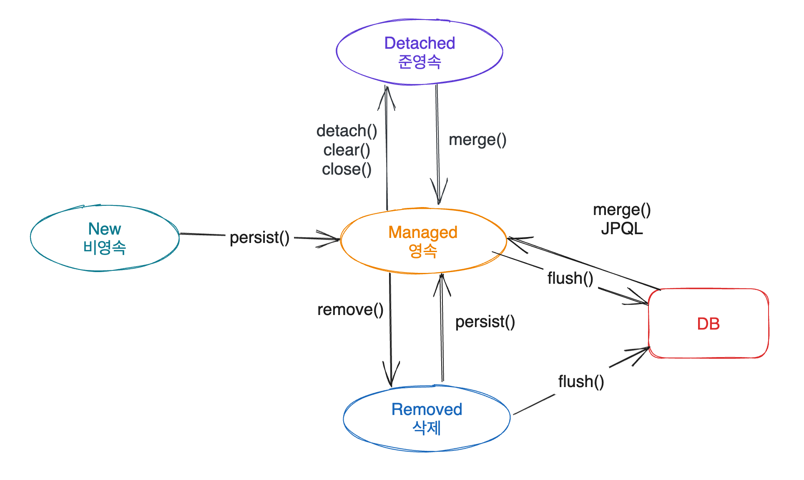

= Spring JPA

== 1일차

=== 관계형 데이터 베이스와 ORM

==== 데이터베이스의 정의

* 데이터를 효율적으로 관리하기 위한 일종의 창고
* 특정 조직의 여러 사용자가 데이터를 공유하여 사용할 수 있도록 통합 저장된 데이터의 집합
* 행과 열로 구성된 시트에서 사용자가 정의한 형식으로 데이터를 관리하는 엑셀파일과 유사

=== 관계형 데이터베이스 (Relational Database)

* 1970년에 E. F. Codd 가 제안한 데이터 관계형 모델에 기초하는 디지털 데이터베이스

==== 관계형 모델 (Relational Model)

* 데이터를 컬럼(column)과 로우(row)를 이루는 하나 이상의 테이블(또는 관계)로 정리
* 고유 키(Primary key)가 각 로우(row)를 식별
* 로우(row)는 레코드(record)나 튜플(tuple)로 부른다
* 관계(Relationship)는 서로 다른 테이블들 사이의 상호작용에 기반을 두고 형성된 논리적 연결이다.
** 관계(Relationship)는 테이블 간에 둘 다 존재한다.
** 이 관계들은 일대일, 일대다, 다대다, 이렇게 세 가지 형태로 이루어진다.

.DataSource
* DriverManager 는 데이터베이스의 상세한 정보(호스트, 포트, 사용자이름, 패스워드)를 제공해 주어야 Connection 을 받아 올 수 있습니다.
* DataSource 는 Connection Pooling 을 제공합니다. 따라서 성능에 대한 확장성이 좋습니다.

=== ORM

.ORM (Object-Relational Mapping)
* ORM 프레임워크가 중간에서 객체와 관계형 데이터베이스를 맵핑
* ORM을 이용하면 DBMS 벤더마다 다른 SQL에 대한 종속성을 줄이고 호환성 향상이 가능

=== JPA

.JPA (Java Persistence API)
* 자바 ORM 기술 표준
* 표준 명세
** JSR 338 - Java Persistence 2.2

=== JPA 를 사용해야 하는 이유
* SQL 중심적인 개발 -> 객체 중심으로 개발
* 패러다임 불일치 해결
* 생산성 향상
* maintenance
* 데이터 접근 추상화와 벤더 독립성

=== Spring Framework 와 JPA

.Spring Data
* 다양한 데이터 저장소에 대한 접급을 추상화하기 위한 Spring 프로젝트
* JPA, JDBC, Redis, MongoDB, Elasticsearch 등

.Spring Data JPA
* repository 추상화를 통해 interface 선언만으로도 구현 가능
* 메서드 이름으로 쿼리 생성
* Web Support (페이징, 정렬, 도메인 클래스 컨버터 기능)

=== Transaction

* 데이터베이스의 상태를 변환시키는 하나의 논리적 기능을 수행하기 위한 작업의 단위 또는 한꺼번에 모두 수행되어야 할 일련의 연산들을 의미합니다.

.@Transactional
* Transaction 범위 안에서 메서드가 실행 된다는 것을 Spring 이 보장해 줌.
* AOP 로 구현되어 있음.
** 따라서 메서드가 private 인 경우 어노테이션이 적용되지 않음.
** 클래스 안의 메서드가 다른 메서드를 호출하는 경우 어노테이션이 적용되지 않음
*** 클래스가 자기 자신을 주입받게 하면 가능

==== Transaction 속성
.Atomicity(원자성)
* 트랜잭션의 수행결과는 데이터베이스에 전부 반영되거나, 전부 반영되지 않아야 합니다.(All or Nothing)

.Consistency(일관성)
* 트랜잭션 수행 후 데이터 모델의 모든 제약조건을 만족해야 합니다.

.Isolation(고립성)
* 트랜잭션 수행 시 다른 트랜잭션이 영향을 미치지 않아야 합니다.

.Durability(영속성)
* 트랜잭션의 성공결과는 장애 발생 후에도 변함없이 보관되어야 합니다.

==== Spring Framework 의 트랜잭션 추상화

.PlatformTransactionManager
* Spring Framework 트랜잭션 추상화의 핵심 interface
* JPA 는 TransactionManager 가 반드시 있어야 함
----
public interface PlatformTransactionManager extends TransactionManager {
    TransactionStatus getTransaction(TransactionDefinition definition) /*..*/;
    void commit(TransactionStatus status) throws TransactionException;
    void rollback(TransactionStatus status) throws TransactionException;
}
----

=== Entity / Entity Mapping

==== Entity 란?

* JPA 를 이용해서 데이터베이스 테이블과 맵핑할 클래스
* JPA 가 알아서 쿼리를 짜도록 정보를 제공하기 위함
* JPA 에서 DB 테이블을 자바 클래스로 매핑하기 위한 클래스

==== Entity Mapping 이란?

* 데이터베이스 테이블을 자바의 클래스로 매핑

=== EntityManager

* 엔터티의 저장, 수정, 삭제, 조회 등 엔터티와 관련된 모든 일을 처리하는 관리자
* Collection framework 와 비슷함
* 캐시 역할을 함
* dirty checking 도 함. 객체의 값이 바뀌면 db 의 값도 바뀜
----
public interface EntityManager {
    public <T> T find(Class<T> entityClass, Object primaryKey);
    public <T> T find(Class<T> entityClass, Object primaryKey, Map<String, Object> properties);
    public <T> T find(Class<T> entityClass, Object primaryKey, LockModeType lockMode);
    public <T> T find(Class<T> entityClass, Object primaryKey, LockModeType lockMode, Map<String, Object> properties);

    public void persist(Object entity); // 삽입

    public <T> T merge(T entity); // 수정

    public void remove(Object entity); // 삭제

    // ...

}
----

=== EntityManagerFactory
* EntityManager 를 생성하는 팩토리
* 하나만 있으면 됨. singleton
----
public interface EntityManagerFactory {
  public EntityManager createEntityManager();
  public EntityManager createEntityManager(Map map);
  public EntityManager createEntityManager(SynchronizationType synchronizationType);
  public EntityManager createEntityManager(SynchronizationType synchronizationType, Map map);

  // ...

}
----

=== SQL
* JPA 가 쿼리를 대신 짜주기 때문에 쿼리문이 내 의도대로 작성되었는지 확인해야 함
* JPA properties
----
hibernate.show-sql=true
hibernate.format_sql=true
----
* logback logger
----
<logger name="org.hibernate.SQL" level="debug" additivity="false">
<appender-ref ref="console" />
</logger>
----
* binding parameters
** Statement ? 자리에 실제로 무슨 값이 들어갔는지 확인하기 위함
* 운영 단계에서는 binding parameters 빼야함
** 실제로는 개발환경과 운영환경의 logback 파일을 따로 둠
----
<logger name="org.hibernate.type.descriptor.sql.BasicBinder" level="trace" additivity="false">
    <appender-ref ref="console" />
</logger>
----

=== 어노테이션

==== 어노테이션
* @Entity : JPA가 관리할 객체임을 명시
* @Table : 맵핑할 DB 테이블 명 지정
* @Id : 기본 키(PK) 맵핑
* @Column : 필드와 컬럼 맵핑 (생략 가능). 생략하는 경우 필드명으로 맵핑
* @Transient : 맵핑에서 제외
----
@Entity
@Table(name = "Members") // 없으면 클래스 이름을 테이블 이름으로 사용
public class Member {
    @Id
    @GeneratedValue(strategy = GenerationType.IDENTITY)
    private Long id;

    private String name;

    @Column(name = "created_dt")
    private LocalDateTime createdDate;

}
----

=== 기본 키 (Primary Key) 맵핑 전략

==== 자동 생성
* TABLE 전략: 채번 테이블을 사용
* SEQUENCE 전략: 데이터베이스 시퀀스를 사용해서 기본 키를 할당
* ex.) Oracle
* IDENTITY 전략: 기본 키 생성을 데이터베이스에 위임
* ex.) MySQL
* AUTO 전략: 선택한 데이터베이스 방언(dialect)에 따라 기본 키 맵핑 전략을 자동으로 선택

==== 직접 할당
* 애플리케이션에서 직접 식별자 값을 할당
** autoincrement 는 @GeneratedValue 사용

=== 복합 키
* @IdClass
* @EmbeddedId / @Embeddable
** 위는 두 개를 쌍으로 같이 써야 함

==== @IdClass 를 이용한 복합 key 지정
.@IdClass
* Entity class 레벨에서 지정
----
@Entity
@Table(name = "OrderItems")
@IdClass(OrderItem.Pk.class)
public class OrderItem {
    @Id
    @Column(name = "order_id")
    private Long orderId;

    @Id
    @Column(name = "line_number")
    private Integer lineNumber;

    // ...

}
----
----
@NoArgsConstructor
@AllArgsConstructor
@EqualsAndHashCode
public static class Pk implements Serializable {
    private Long orderId;

    private Integer lineNumber;

}
----

=== @EmbeddedId / @Embeddable를 이용한 복합 Key 지정

==== @EmbeddedId / @Embeddable

* @EmbeddedId - Entity 클래스의 필드에 지정
* @Embeddable - 복합 Key 식별자 클래스에 지정
* 조금 더 객체 지향 관점에 맞는 스타일
----
@Entity
@Table(name = "OrderItems")
public class OrderItem {
    @EmbeddedId
    private Pk pk;

    // ...

}
----
----
@NoArgsConstructor
@AllArgsConstructor
@EqualsAndHashCode
@Embeddable
public static class Pk implements Serializable {
    @Column(name = "order_id")
    private Long orderId;

    @Column(name = "line_number")
    private Integer lineNumber;

}
----

=== 복합 Key Class 제약조건

==== 복합 Key Class 제약조건

* PK 제약조건을 그대로 따름

==== PK 제약 조건

* The primary key class must be public and must have a public no-arg constructor.
* The primary key class must be serializable.
* The primary key class must define equals and hashCode methods.

=== EntityManager / EntityManagerFactory 다시 돌아보기

.EntityManagerFactory
* EntityManager를 생성하는 팩토리
* 데이터베이스를 하나만 사용하는 애플리케이션은 일반적으로 EntityManagerFactory를 하나만 사용
** EntityManagerFactory를 만드는 비용이 매우 크기 때문에 하나만 만들어서 전체에서 공유
** thread safe

.EntityManager
* Entity의 저장, 수정, 삭제, 조회 등 Entity와 관련된 모든 일을 처리하는 관리자
* EntityManagerFactory 가 생성 → 생성 비용이 크지 않다
* EntityManager는 thread safe 하지 않음
** 여러 thread 간에 절대 공유하면 안 됨
* 각각의 요청마다 별도의 EntityManager를 생성해서 사용

=== 영속성 컨텍스트

==== 영속성 컨텍스트

* Entity 를 저장하는 환경
----
@PersistenceContext
----

=== Entity 의 생명주기

.비영속(new/transient)
* 영속성 컨텍스트와 전혀 상관 없는 상태

.영속 (managed)
* 영속성 컨텍스트에 저장된 상태

.준영속 (detached)
* 영속성 컨텍스트에 저장되었다가 분리된 상태

.삭제 (removed)
* 삭제된 상태
** clear : Entity Manager 의 캐시 메모리를 다 날리고 DB 에 있는 걸로 최신화 함

==== 영속성 컨텍스트가 Entity를 관리하면 얻을 수 있는 이점
.장점
* 1차 캐시
* 동일성 보장
* 트랜잭션을 지원하는 쓰기 지연
* 변경 감지
* 지연 로딩

.단점
* 대량으로 데이터를 처리할 때 1차 캐시 역할 때문에 메모리를 많이 잡아먹는다
* 잘못하면 프로그램 죽음

== 2일차

=== 연관관계 맵핑

==== 데이터베이스 테이블 간의 관계(relationship)

.데이터베이스 정규화
* 정규화는 중복 데이터로 인해 발생하는 데이터 불일치 현상을 해소하는 과정

==== 연관 관계(association)
* 데이터베이스 테이블 간의 관계(relationship)를 Entity 클래스의 속성(attribute)으로 모델링
* 데이터베이스 테이블은 외래 키(FK)로 JOIN을 이용해서 관계 테이블을 참조
** 객체는 참조를 사용해서 연관된 객체를 참조
* ERD 에 있는 연관 관계를 다 할 필요는 없음. 필요 없으면 안해도 무방.

=== 연관 관계

==== 외래 key(FK) 맵핑
* @JoinColumn : 외래 키 맵핑
* @JoinColumns : 복합 외래 키 맵핑

==== Member Entity
----
@Entity
@Table(name="Members")
public class Member {
    @Id
    @Column(name = "member_id")
    private String id;

    @Column(name = "user_name")
    private String userName;

    @ManyToOne(fetch = FetchType.EAGER, cascade = CascadeType.ALL)
    @JoinColumn(name = "team_id")
    private Team team;
}
----

==== 다중성
* @OneToOne
* @OneToMany
* @ManyToOne
* (@ManyToMany)
** ManyToMany는 없다고 생각하라는 의미로 ()를 넣음. 현업에서는 다대다로 설계를 하는 경우 다른 컬럼들이 계속 생겨남(생성일, 수정일, 카운트 등등)
** 따라서 차라리 다대일, 일대다로 뜯어서 설계하는게 낫다.

=== Fetch 전략 (fetch)
* JPA가 하나의 Entity를 가져올 때 연관관계에 있는 Entity들을 어떻게 가져올 것인지에 대한 설정

==== Fetch 전략
* FetchType.EAGER (즉시 로딩) : Member 객체를 가져올 때 Team 객체도 같이 가져옴. 쿼리 1번 날아감(join query).
* FetchType.LAZY (지연 로딩) : Team 멤버 변수를 참조할 때 쿼리를 날려 가져옴. 즉 쿼리 2번 날아감.

==== 다중성과 기본 Fetch 전략
* *-ToOne (@OneToOne, @ManyToOne ) : FetchType.EAGER
* *-ToMany (@OneToMany, @ManyToMany) : FetchType.LAZY

=== 영속성 전이 (Cascade)

==== 영속성 전이
* Entity의 영속성 상태 변화를 연관된 Entity에도 함께 적용
* 연관관계의 다중성 (Multiplicity) 지정 시 cascade 속성으로 설정
----
@OneToOne(cascade = CascadeType.PERSIST)
@OneToMany(cascade = CascadeType.ALL)
@ManyToOne(cascade = { CascadeType.PERSIST, CascadeType.REMOVE })
----

=== 연관관계의 방향성
* 단방향(unidirectional)
* 양방향(bidirectional)

==== 양방향 연관 관계
* 관계의 주인(owner)
** 연관 관계의 주인은 외래 키(FK)가 있는 곳
** 연관 관계의 주인이 아닌 경우, mappedBy 속성으로 연관 관계의 주인을 지정

==== 예제
* 양방향(bidirectional) 연관 관계
** 관계의 주인(owner): 외래 키(FK)가 있는 곳
*** Member
** 관계의 주인이 아닌 경우: mappedBy 속성으로 연관 관계의 주인을 지정
*** Team

.Member Entity
----
@Entity
@Table(name="Members")
public class Member {
    @Id
    @Column(name = "member_id")
    private String id;

    @Column(name = "user_name")
    private String userName;

    @ManyToOne(fetch = FetchType.EAGER, cascade = CascadeType.ALL)
    @JoinColumn(name = "team_id")
    private Team team;
}
----

.Team Entity
----
@Entity
@Table(name = "Teams")
public class Team {
    @Id
    @Column(name = "team_id")
    private String id;

    @Column(name = "team_name")
    private String name;

    @OneToMany(mappedBy = "team", fetch = FetchType.EAGER) // mappedBy = "관계의 주인 테이블의 외래키 속성명";
    private List<Member> members;
}
----

=== 단방향 vs 양방향
* 단방향일 때는 JoinColumn 을 둘 중 아무데나 써도 상관 없으나 양방향으로 하고자 할 때는 fk 의 주인에 JoinColumn 을 작성해야 함
==== 단방향 맵핑만으로 연관관계 맵핑은 이미 완료
* JPA 연관관계도 내부적으로 FK 참조를 기반으로 구현하므로 본질적으로 참조의 방향은 단방향

==== 단방향에 비해 양방향은 복잡하고 양방향 연관관계를 맵핑하려면 객체에서 양쪽 방향을 모두 관리해야 함
* 물리적으로 존재하지 않는 연관관계를 처리하기 위해 mappedBy 속성을 통해 관계의 주인을 정해야 함

==== 단방향을 양방향으로 만들면 반대 방향으로의 객체 그래프 탐색 가능
* 우선적으로는 단방향 맵핑을 사용하고 반대 방향으로의 객체 그래프 탐색 기능이 필요할 때 양방향을 사용

=== 단방향 1:1 관계
* ERD 에서 foreign key 가 있는 곳에 JoinColumn 어노테이션
* 양방향으로 하고 싶으면 foreign key 없는 곳에 mappedBy 속성 달기

=== 1:1 식별 관계
* 주 테이블의 primary key 를 보조 테이블에서 primary key 이자 foreign key 로 사용.
* 외래키 가지고 있는 곳에서 @MapsId
** @MapsId = primary key 가 foreign key 이다. 즉, 같다.

=== 단방향 일대다 관계

==== 단점
* 다른 테이블에 외래 키가 있으면 연관관계 처리를 위해 추가적인 UPDATE 쿼리 실행

==== 해결
* 단방향 일대다(1:N) 관계보다는 양방향 맵핑을 사용하자
** 어지간하면 단방향을 사용하지만 일대다 경우에는 양방향을 사용하자

=== 양방향 일대다 관계

=== Repository

==== Repository의 정의
* 도메인 객체에 접근하는 컬렉션과 비슷한 인터페이스를 사용해 도메인과 데이터 맵핑 계층 사이를 중재(mediate)
** 마틴 파울러, P of EAA
* a mechanism for encapsulating storage, retrieval, and search behavior which emulates a collection of objects
** 에릭 에반스, DDD

==== 주의할 점
* Repository는 JPA의 개념이 아니고, Spring Framework가 제공해주는 것임.

=== Spring Data Repository
* data access layer 구현을 위해 반복해서 작성했던, 유사한 코드를 줄일 수 있는 추상화 제공
----
// EntityManager를 통해 entity를 저장, 수정, 삭제, 조회
// create, update, delete, and look up entities through EntityManager
Item entity1 = new ItemEntity();
entity1.setItemName("peach");
entity1.setPrice(135L);
entityManager.persist(entity1);

Item entity2 = entityManager.find(ItemEntity.class, entity1.getItemId());
entity2.setPrice(235L);
entityManager.merge(entity2);

// JPQL, Criteria API를 이용해서 복잡한 쿼리 수행
// complex query can be executed by using JPQL, Criteria API
String jpql = "select item from Item item where item.itemName like '%peach%'";
List<ItemEntity> entites = entityManager.createQuery(jpql, ItemEntity.class)
                                        .getResultList();
----

=== Repository 설정

* EntityManager 가 SimpleJpaRepository 에 추상화 되어 있음. 따라서 쿼리가 나감
* Ex.) ItemRepository 인터페이스
* JpaRepository interface 상속
* EntityManager 는 persist 와 merge 로 나눠져있지만 JpaRepository 는 save 하나
----
public interface ItemRepository extends JpaRepository<Item, Long> {
}
----

=== @Repository와 Spring Data Repository의 차이점

==== @Repository
* org.springframework.stereotype.Repository
* Spring Stereotype annotation
** Ex.) @Controller, @Service, @Repository, @Component
* @ComponentScan 설정에 따라 classpath scanning을 통해 빈 자동 감지 및 등록
* 다양한 데이터 액세스 기술마다 다른 예외 추상화 제공
** DataAccessException, PersistenceExceptionTranslator

==== Spring Data Repository
* org.springframework.data.repository
* @EnableJpaRepositories 설정에 따라 Repository interface 자동 감지 및 동적으로 구현 생성해서 Bean으로 등록
* cf.) @NoRepositoryBean
** Spring Data Repository bean으로 등록하고 싶지 않은 중간 단계 interface에 적용

=== 메서드 이름으로 쿼리 생성
* Spring Data JPA에서 제공하는 기능으로 이름 규칙에 맞춰 interface에 선언하면 쿼리 생성
* cf.)
** https://docs.spring.io/spring-data/jpa/reference/repositories/query-keywords-reference.html#appendix.query.method.subject
** https://docs.spring.io/spring-data/jpa/reference/jpa/query-methods.html#jpa.query-methods.query-creation

.예제
----
public interface ItemRepository {
    // select * from Items where item_name like '{itemName}'
    List<Item> findByItemNameLike(String itemName);

    // select item_id from Items
    // where item_name = '{itemName}'
    // and price = {price} limit 1
    boolean existsByItemNameAndPrice(String itemName, Long price);

    // select count(*) from Items where item_name like '{itemName}'
    int countByItemNameLike(String itemName);

    // delete from Items where price between {price1} and {price2}
    void deleteByPriceBetween(long price1, long price2);
}

----

=== 복잡한 쿼리 작성

==== JPA에서 제공하는 객체 지향 쿼리
* JPQL: 엔티티 객체를 조회하는 객체 지향 쿼리
* Criteria API: JPQL을 생성하는 빌더 클래스

==== third party library를 이용하는 방법
* Querydsl
* jOOQ
* …

=== JPQL vs Criteria API

=== JPQL
* SQL을 추상화해서 특정 DBMS에 의존적이지 않은 객체지향 쿼리
* 문제 : 결국은 SQL이라는 점
** 문자 기반 쿼리이다보니 컴파일 타임에 오류를 발견할 수 없다
----
SELECT DISTINCT post
FROM Post post
JOIN post.postUsers postUser
JOIN postUser.projectMember projectMember
JOIN projectMember.member member
WHERE member.name = 'dongmyo'
----

== 3일차

=== Repository 고급
==== @Query
* JPQL 쿼리나 Native 쿼리를 직접 수행
----
@Query("select i from Item i where i.price > ?1")
List<Item> getItemsHavingPriceAtLeast(long price);

// true 일 경우 db 의 쿼리 사용 명시
// nativeQuery 를 쓰면 나중에 db 를 바꾸기 쉽지 않음
@Query(value = "select * from Items where price > ?1", nativeQuery = true)
List<Item> getItemsHavingPriceAtLeast2(long price);
----

==== @Modifying
* @Query 를 통해 insert, update, delete 쿼리를 수행할 경우 붙여줘야 함
----
@Modifying
@Query("update Item i set i.itemName = :itemName where i.itemId = :itemId")
int updateItemName(@Param("itemId") Long itemId, @Param("itemName")String itemName);
----

== 더보기
* MyBatis 를 많이 사용함
* Spring Data JDBC, JDBC Template
* JPA 책 추천 : 김영한님이 쓰신 JPA 책
** 책 처음부터는 hibernate 설정이 있고 Spring 은 이를 추상화해놓음
* Gradle 은 스크립트로 되어 있음
* Maven 은 플러그인으로 되어 있음
* Connection 을 생성할 때 비용이 많이 들기 때문에 Connection Pool 사용
* ORM : Object Relational Mapping
* 보일러 플레이트 코드 : 작업을 할 때 매번 작성해야 하는 코드
* MERGE INTO : INSERT OR UPDATE. 없으면 INSERT 있으면 UPDATE
* Java EE, SE, ME :
** Enterprise Edition, Standard Edition, Micro Edition
* 오라클이 2017년 Java EE 8 릴리즈를 마지막으로 오픈소스 SW를 지원하는 비영리 단체인 Eclipse 재단에 Java EE 프로젝트를 이관
** 패키지 이름이 회사 주소의 역순이므로 상당히 중요. 업데이트 하면 import 가 다 깨짐
** Jakarta EE 9부터 namespace 변경 : javax -> jakarta
* Servlet 이란 스펙. Servlet 을 구현한게 tomcat
* Java EE 에 따라 정해진 tomcat 버전이 있음
* Spring 과 hibernate 는 EJB(Enterprise Java Bean) 때문에 나옴. EJB 의 스펙이 너무 과함
* Spring Boot 를 사용하면 @EnableWebMvc 어노테이션 같은 세팅 어노테이션을 안써도 됨. 자기가 만든 setting 을 사용할 경우 명시적으로 적어줘야함
* assertThat(ReflectionTestUtils.invokeGetterMethod(order1, "orderId")).isEqualTo(1001L);
** Reflection 을 이용해 아직 만들지 않은 메서드나 private 메서드를 테스트할 수 있음
* Hibernate 는 insert / update / delete 를 각각 모아서 차례대로 실행함
* DDD : Domain Driven Design
* 하나의 DB 테이블에 여러 개의 클래스를 매핑하기 -> 가능
* 하나의 컬럼에 여러 개의 필드를 매핑 -> 불가능. 단, 두 개 이상의 필드를 사용하는 경우 insertable, updatable = false 로 해야함